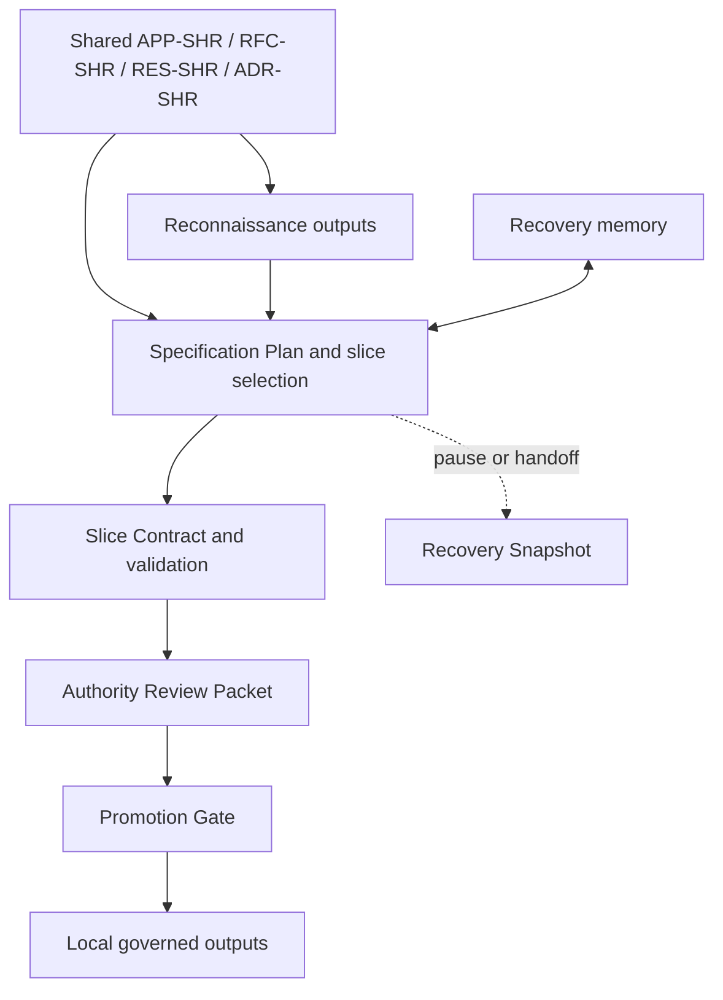

# Applying NLSpec Reverse Recovery to Repository Systems

## Purpose and boundary

This document is a non-normative companion to `SPEC-SHR-000`, `SPEC-SHR-001`, `SPEC-SHR-002`, `SPEC-SHR-003`, `SPEC-SHR-004`, `SPEC-SHR-005`, `SPEC-SHR-006`, `APP-SHR-002`, `APP-SHR-004`, and `APP-SHR-005`. It provides broader operational guidance for applying those specifications together when reverse-engineering a repository from a cold start.

It covers the wider or more revisable operational seams that remain after the stabilized first-loop, repository-shaped, and authority or promotion baselines are already understood:

- establishing and evolving a governed workspace for recovery artifacts and promoted outputs
- recovery-memory conventions, storage layout, and consultation timing
- partial recovery, resumable handoff, and Recovery Snapshot practice
- initial triage heuristics for identifying high-value recovery slices
- recurring patterns for scope declarations and compatibility targets
- composition examples showing the specifications working together end-to-end
- shared informative resources during reverse recovery
- later-stage failure and correction patterns
- reference operational templates for wider draft practice

This document does not create binding requirements. Where it uses directive language ("do X before Y"), the directive is a recommendation grounded in the governing specifications, not an independent obligation. The governing specifications control in every case of conflict.

When this APP restates a normative requirement, it should attribute that requirement to the governing `SPEC`. Otherwise it should use recommendation language rather than functioning as a second obligation surface.

This document explains usage and composition. It does not create new authority, adoption, or promotion rules. This APP is auxiliary by default. For taxonomy-naive repositories it is outside the minimum initial packet named by `APP-SHR-003` and should be entered only when a named wider seam such as recovery memory, partial recovery, later-stage correction, or composition guidance actually triggers it.

This document does not extend `SPEC-SHR-002` workflow semantics, `SPEC-SHR-004` artifact schemas, the `SPEC-SHR-000` document-class taxonomy or authority model, or the `SPEC-SHR-001` completeness framework. It applies them.

`APP-SHR-003` remains the corpus router. `SPEC-SHR-005` and `SPEC-SHR-006` own the short normative cold-start profiles. `SPEC-SHR-003` owns the normative minimum workspace topology and workspace structural posture model. `SPEC-SHR-004` owns canonical governed-artifact schemas. `APP-SHR-002` remains the APP-layer quickstart for the default topology plus the first-loop templates and first-loop correction. `APP-SHR-004` owns the stable repository-shaped operating baseline for reconnaissance, executable-feasibility floor, target-anchor axis mapping, and repository-surface-family operating patterns. `APP-SHR-005` now owns the stable authority-closure and promotion-handoff baseline. This document begins where those stabilized surfaces stop and therefore stays focused on broader or more revisable repository-shaped practice rather than on the stable baselines themselves.

This APP remains `draft` because it intentionally retains broader, more revisable, or composition-heavy operating material than the stabilized entry pack, repository-shaped baseline, and authority or promotion baseline.

## Relation to governing specifications

The target repository, the codebase being reverse-engineered, is typically ungoverned. It has no `/.nlspec/` bootstrap, no SPEC-SHR-000 document classes, and no forward-authored NLSpec. That absence is the reason reverse recovery exists. The governing specifications apply to the artifacts the agent produces and to any explicitly referenced shared governed documents that inform the recovery effort. They do not retroactively govern the target repository's pre-existing files.

SPEC-SHR-000 governs two relevant surfaces in a reverse-recovery engagement. First, it governs the local bootstrap, scan rules, naming, front matter, lifecycle, and authority model for the governed output workspace. Second, it governs the shared governed-document taxonomy and default authority semantics for explicitly referenced shared documents. In practical terms, it tells the agent what a shared `SPEC-SHR`, `APP-SHR`, `ADR-SHR`, `RFC-SHR`, or `RES-SHR` document is, how it is identified, and what authority it carries by default. SPEC-SHR-000 still does not describe the target repository's existing structure, which may follow any convention or none. Shared governed documents remain explicitly referenced inputs rather than scan-discovered local authority.

`SPEC-SHR-003` governs the local reverse-recovery topology, structural posture, discovery surface, and effective schema-companion resolution. In practical terms, it tells the agent where the reverse-recovery tree lives, which minimum carriers are resolved by default, how the governing Specification Plan is discovered, where the latest Recovery Snapshot is designated when one exists, where authoritative local reverse-recovery overrides are declared when a workspace uses them, and how recovery-derived governed outputs are recognized structurally.

SPEC-SHR-001 defines what an NLSpec is and provides the judgment framework used throughout recovery: completeness, precision, recreatability, conceptual fidelity, spec economy, and the distinction between intentional and accidental ambiguity. That framework is the standard by which reverse-recovery guidance remains sufficient without becoming redundant.

`SPEC-SHR-002` governs the reverse-recovery workflow: artifact-role inventory semantics, slice workflow, support levels, evidence handling, validation, authority review, recovery memory, partial recovery handoff, and the Promotion Gate. `SPEC-SHR-004` governs the canonical field minima, omission semantics, continuity-key rules, overlay matrix, and worked schema examples for the governed artifacts used by that workflow. `APP-SHR-005` provides the stable APP-layer baseline for packet-first authority intake, same-operator disclosure, minimum viable disposition practice, and promotion-handoff assembly. When no local recovery-memory profile is declared, `APP-SHR-001 / Recovery memory in practice` is the shared default operational profile for materializing that memory mechanism in repository-shaped work; it does not create a second normative schema surface.

This document therefore occupies an operational seam. It explains how to move from an ungoverned target repository to a governed recovery effort and how to organize the resulting working state so that the workflow remains legible, reviewable, and resumable. It is the outer-ring companion for wider seams, not part of the first-loop foundation packet.

Within this APP, `workspace topology` means the governed recovery workspace and governed output placement owned normatively by `SPEC-SHR-003`. `Target-system structure` means the structure of the repository being reverse-engineered, such as build graphs, deployment topology, configuration planes, generated artifacts, extension surfaces, data stores, and service seams. This APP uses those terms distinctly and does not collapse one into the other.

Shared-document authority and evidentiary weight are governed once, by SPEC-SHR-000 Authority rules and SPEC-SHR-002 Source hierarchy. This APP describes only operational use and recording practice for those materials.

### Maintenance note

This APP should be reviewed whenever `SPEC-SHR-002` changes workflow entry minima, recovery-memory obligations, or later-stage correction semantics that this document operationalizes, whenever `SPEC-SHR-004` changes governed-artifact schema minima or overlay matrix rules that this document routes to, whenever `SPEC-SHR-003` changes reverse-recovery discovery semantics used by the workspace examples in this document, and whenever `APP-SHR-004`, `APP-SHR-005`, `SPEC-SHR-005`, or `SPEC-SHR-006` changes a stabilized baseline surface that this document now treats as extracted or routed elsewhere. This note is operational only. It does not create binding authority.

## Stable-baseline relocation crosswalk

This crosswalk is non-normative. It records which historically important stable sections now live in `APP-SHR-004` or `APP-SHR-005` and why the old headings remain here as relocation notes.

| Historical `APP-SHR-001` section | Stable baseline now lives at | Why the historical heading remains here |
|---|---|---|
| `APP-SHR-001 / Repository reconnaissance` | `APP-SHR-004 / Repository reconnaissance` | existing corpus pointers should keep resolving during transition |
| `APP-SHR-001 / Executable validation feasibility floor` | `APP-SHR-004 / Executable validation feasibility floor` | first-loop and draft APP references should fail softly rather than hard-break |
| `APP-SHR-001 / Scope declaration and compatibility target patterns / Repository-shaped target-anchor axis mapping` | `APP-SHR-004 / Repository-shaped target-anchor axis mapping` | target-anchor guidance moved to the stable baseline but the old subsection name remains a useful router |
| `APP-SHR-001 / Authority review in practice` | `APP-SHR-005 / Packet-first authority intake`; `APP-SHR-005 / Review-mode choice in practice`; `APP-SHR-005 / Copy-adapt template: explicit local same-operator authority designation`; `APP-SHR-005 / Minimum viable Authority Disposition` | stable authority and disposition guidance moved to the dedicated baseline, but the old heading remains a useful router |
| `APP-SHR-001 / Appendix C: Promotion handoff and recovered-behavior representation` | `APP-SHR-005 / Boundary-clean promotion transformation`; `APP-SHR-005 / Recovered-behavior representation mapping`; `APP-SHR-005 / Promotion-trace assembly and review checks` | promotion-handoff guidance moved to the dedicated stable baseline, but historical links should still resolve |
| `APP-SHR-001 / Appendix D: Target-System Structure Recovery Patterns` | `APP-SHR-004 / Repository-shaped structure recovery patterns` | historical Appendix D links should still route readers to the stabilized baseline |

## Why reverse recovery exists and what it does not fix

Earlier corpus drafts sometimes used `reverse-spec` or `reverse mode` as historical aliases. This APP uses `reverse recovery` as the canonical term.

A disciplined reverse-recovery workflow improves prioritization, extraction, validation, review, and authority handoff. It makes uncertainty visible, keeps clause support reviewable, and often recovers enough to support cleanroom reimplementation, compatibility preservation, migration, or durable documentation.

It does not solve the Hyrum or intent gap by magic. Reverse recovery can show that a behavior is real, reproducible, and sometimes externally depended on. It cannot tell, from evidence alone, whether an accidental behavior should bind the future. That decision remains normative and therefore belongs to authority review rather than to inference volume.

Reverse recovery is a repair path, not a replacement for the forward model:

**Implementation -> Behavioral Description -> Provisional Contract -> Ratified NLSpec -> Future Implementation**

The path is useful precisely because the forward `Intent -> NLSpec -> Implementation` chain was skipped, only partially followed, or later lost. Recovered artifacts can become strong and durable, but they begin from weaker epistemic footing than forward-authored specifications and therefore need stronger visible provenance, anchoring, and bounded judgment.

## Crosswalk from NLSpec quality to reverse-recovery artifacts

`SPEC-SHR-001` and `SPEC-SHR-002` govern different surfaces. The first defines what makes a specification complete, precise, and faithful. The second defines how a recovery effort stores uncertainty, validates clauses, and decides whether a recovered surface is ready for promotion. The tables below are a translation aid between those two surfaces. They do not create a sixth completeness dimension, a second Promotion Gate, or a parallel authority ladder.

| `SPEC-SHR-001` property | Primary `SPEC-SHR-002` completeness dimensions | Recovery implication |
|---|---|---|
| Behavioral Completeness | `behavioral`, `boundary`, and `environment` when regime changes behavior | Recover the full caller-visible effect of the clause for the declared scope, including terminal behavior, failure behavior, and regime-sensitive divergence. |
| Unambiguous Interfaces | `interface` and `boundary` | Recover field meaning, sequencing, state vocabulary, error shape, and machine-parsed surface behavior precisely enough that independent replacements connect without guesswork. |
| Explicit Defaults and Boundaries | `boundary`, `environment`, and `metric` when the measurement regime changes the default path | Recover omitted-value behavior, limits, reset assumptions, timeout handling, and comparison regime instead of leaving the common case implicit. |
| Mapping Tables for Translation | `interface`, `behavioral`, and `boundary` | Recover row-complete cross-surface mappings, including fallback, derivation, and no-direct-literal cases, so translation does not depend on local guesswork. |
| Testable Acceptance Criteria | `behavioral`, `interface`, `boundary`, `metric`, and `environment` | Express closure as explicit slice criteria and observed or bounded pass conditions rather than as a general claim that the system basically works. |

| `SPEC-SHR-001` property | Specification Plan fields | Slice Contract and overlay fields | Validation Report fields | Promotion Gate items |
|---|---|---|---|---|
| Behavioral Completeness | `completeness_dimensions`, `candidate_clause`, `artifact_roles`, `risk_impact`, `stop_condition` | `discriminating_question`, `required_criteria`, `validation_mode`, `expected_observables`, `lifecycle_overlay.transition_rules` | `criterion_results`, `interpretation.expected_outcome`, `interpretation.observed_outcome`, `interpretation.contractual_significance` | `PG-3`, `PG-7`, `PG-9`, `PG-13`, `PG-14` |
| Unambiguous Interfaces | `candidate_clause`, `ambiguity_status`, `ambiguity_note`, `artifact_roles` | `required_criteria`, `expected_observables`, `lifecycle_overlay.canonical_state_vocabulary`, `lifecycle_overlay.external_status_mapping` | `criterion_results.observed_divergence`, `interpretation.expectation_delta` | `PG-1`, `PG-3`, `PG-5`, `PG-13`, `PG-14` |
| Explicit Defaults and Boundaries | `regime_or_environment_status`, `regime_or_environment_note`, `negative_evidence_status`, `negative_evidence_refs`, `stop_condition` | `execution_preconditions`, `environment_assumptions`, `mutation_policy`, `reset_method`, `non_executable_resolution.closure_rule` | `witness_refs`, `validator_record.known_limitations`, `interpretation.contractual_significance` | `PG-3`, `PG-9`, `PG-10`, `PG-13`, `PG-14` |
| Mapping Tables for Translation | `artifact_roles`, `candidate_clause`, `completeness_dimensions` | `required_criteria`, `expected_observables`, `lifecycle_overlay.observed_to_canonical_mapping`, `lifecycle_overlay.external_status_mapping` | `criterion_results`, `interpretation.observed_outcome`, `cross_overlay_findings` | `PG-3`, `PG-7`, `PG-12`, `PG-13`, `PG-14` |
| Testable Acceptance Criteria | `current_step_id`, `step_list`, `step_list.basis_refs`, `next_corrective_action`, `stop_condition`, `authority_disposition_needed` | `required_criteria`, `corrective_next_action`, `validation_mode`, `memory_refs_consulted` | `criterion_results.outcome`, `criterion_results.corrective_next_action`, `interpretation.next_move`, `validator_record` | `PG-5`, `PG-9`, `PG-10`, `PG-16` |

| `SPEC-SHR-001` test or discipline | `SPEC-SHR-002` operationalization | Failure signal |
|---|---|---|
| Two-implementer test | Use one narrow `candidate_clause`, explicit `required_criteria`, and exact `expected_observables` or `non_executable_resolution` so that independent recoverers would close the same slice the same way. | `ambiguity_status` remains open or the criteria still permit materially different boundary outcomes. |
| Recreatability test | Drive toward `PG-14` by carrying explicit declared scope, `recovery_objective`, `compatibility_target`, normalized `target_anchor`, `completeness_dimensions`, `artifact_roles` linked to stable inventory items, and reviewable chain-capable `evidence_chain_refs` until the declared scope can stand without hidden knowledge. | A competent implementer would still need unstated defaults, a missing or unstable `target_anchor`, unstated environment state, or unrecovered boundary behavior to reproduce the system. |
| Economy test | Enforce one-discriminating-question-per-slice through a singular `discriminating_question`, a narrow `candidate_clause`, minimal `required_criteria`, and a concrete `next_corrective_action`. | One slice contains multiple independent questions, multiple live conjunctions, or a `step_list` that is compensating for an over-broad clause. |
| Conceptual fidelity check | Keep `candidate_clause` boundary-centered, use `concept_overlay` only when intermediate semantics are needed for reviewability, and remove mechanistic residue before `PG-15`. | The clause reads as current helper order, file layout, or local decomposition rather than as boundary meaning. |
| Intentional versus accidental ambiguity check | Make uncertainty explicit in `ambiguity_status`, `ambiguity_note`, `negative_evidence_status`, and authority routing when present behavior does not by itself decide future normativity. | Silence is treated as implementer freedom even though caller-visible divergence remains possible. |

This crosswalk is informative only. It helps authors and reviewers translate between NLSpec quality language and reverse-recovery workflow mechanics. Read workflow meaning through `SPEC-SHR-002` and canonical field minima through `SPEC-SHR-004` when the same row names a governed artifact field. It does not add a sixth completeness dimension, does not create new governed fields, and does not create a second Promotion Gate.

When a recovered clause translates among non-identical external vocabularies, statuses, wire literals, error codes, or field-name systems, use the row-complete mapping form required by SPEC-SHR-002 / Completeness and Criteria / Translation-surface completeness and mapping form. This APP does not define a second trigger rule. It helps recovery authors recognize common repository surfaces that fall under the governing one.

## Repository reconnaissance

Stable repository-shaped reconnaissance guidance now lives in `APP-SHR-004 / Repository reconnaissance`.

This section remains in `APP-SHR-001` only as a relocation note so historical pointers continue to resolve during the transition to the stabilized baseline. Use `APP-SHR-004` when the need is the stable baseline for reconnaissance outputs, reconnaissance order, draft-inventory translation, or first-pass `repository_surface_families` classification. Use the broader `APP-SHR-001` body only when the engagement also needs draft-stage composition examples, later-stage failure patterns, or other revisable operating material that intentionally remains outside the stable baseline.

## Expanded workspace topology in practice

The target repository has its own structure, whatever its original authors chose. The agent's recovery artifacts and eventual governed documents need a home that does not collide with that existing structure and that cleanly separates SPEC-SHR-002 working artifacts from SPEC-SHR-000 governed outputs. `SPEC-SHR-003` now owns the corpus-default minimum topology. This section begins after that baseline and describes recommended expansions once authority packets, shared inputs, digests, or promoted outputs need dedicated homes. Engagements may choose differently depending on whether the workspace lives within the target repository, adjacent to it, or in a separate repository entirely.

### The placement problem

Two kinds of artifacts need homes. SPEC-SHR-002's governed working artifacts, including Specification Plans, Slice Contracts, Validation Reports, Evidence Bundles, Critique Reports, Authority Review Packets, Recovery Snapshots, and Authority Dispositions, are working state governed by SPEC-SHR-002's schemas. SPEC-SHR-000's governed documents, SPECs, APPs, ADRs, RFCs, and RES notes, are the eventual outputs of recovery, governed by SPEC-SHR-000's document-class taxonomy, front matter schema, and lifecycle rules.

These two artifact families have different lifecycle models, different structural contracts, and different authority rules. They should not be interleaved. Forcing recovery working artifacts into SPEC-SHR-000 classes creates a false choice: either the artifact's front matter and lifecycle obey SPEC-SHR-000, which does not know about SPEC-SHR-002's schema contracts, or they obey SPEC-SHR-002, which makes them non-conforming under SPEC-SHR-000's reader rules. Neither outcome is clean.

### Recommended approach: governed workspace with separate recovery tree

Establish a governed workspace, either as a subtree within the target repository or as a separate repository, that carries its own SPEC-SHR-000 bootstrap. The bootstrap's `document_roots` point to the location where promoted governed documents will live. The SPEC-SHR-002 recovery tree lives outside those roots, either excluded explicitly or placed outside `document_roots` entirely.

For reverse-recovery adoption, the bootstrap should usually declare explicit `document_roots` such as `/specs`. Full-repository scan remains conforming under `SPEC-SHR-000` when `document_roots` is omitted, but it is usually the wrong default for large or mixed-governance target repositories.

When the workspace lives within the target repository, a practical layout is:

The tree below is an expanded operational example, not a second statement of the normative baseline. `SPEC-SHR-003` continues to own the minimum topology and posture rules.


```
<target-repo>/
  ...                               # existing target repo contents (ungoverned)
  .nlspec/
    authoritative-sources.yaml      # SPEC-SHR-000 bootstrap (agent-created)
    reverse-recovery.yaml           # SPEC-SHR-003 workflow adoption and discovery (agent-created)
  specs/                            # governed document tree (agent-created)
    SPEC-001-<slug>.md              # promoted Level 3 specs (when ready)
    APP-001-<slug>.md               # companion documents (when ready)
  recovery/                         # SPEC-SHR-002 working tree (excluded from scan)
    plan.yaml                       # Specification Plan (all slices)
    authority/
      packets/
        ARP-0001.yaml               # Authority Review Packets
      dispositions/
        AD-0001.yaml                # Authority Dispositions
    slices/
      <slice-id>/
        contract.yaml               # Slice Contract
        reports/
          validation-<n>.yaml       # Validation Reports
          critique-<n>.yaml         # Critique Reports
        evidence/
          <bundle-id>.yaml          # Evidence Bundles
    recon/
      system-sketch.md              # Reconnaissance system sketch
      artifact-roles.yaml           # Draft artifact-role inventory
      candidate-slices.md           # Candidate slice list
    memory/
      index.yaml                    # current entry index and supersession map
      contract-patterns.md          # human-readable digest
      strategy.md                   # human-readable digest
      technical-witnesses.md        # human-readable digest
      contract-patterns/
        CPM-0001.yaml               # per-entry memory record
      strategy/
        STR-0001.yaml               # per-entry memory record
      technical-witnesses/
        TWM-0001.yaml               # per-entry memory record
    snapshots/
      RS-0001.yaml                  # Recovery Snapshots
  inputs/
    shared/                         # optional read-only shared support corpus
      <shared-doc>.md               # APP-SHR / RFC-SHR / RES-SHR / ADR-SHR inputs
```

Use the corpus-default bootstrap and discovery-file defaults defined by `SPEC-SHR-003` and mirrored in `APP-SHR-002 / The smallest viable workspace`, updated to the current workflow version, unless the expanded workspace needs non-default locators such as `latest_snapshot_locator` or `local_override_locator`. Under `SPEC-SHR-003`, omission of `plan_locator` means the governing Specification Plan lives at `/recovery/plan.yaml`, omission of `memory_locator` means the designated recovery-memory root lives at `/recovery/memory/`, and omission of `recovery_artifact_schema_spec_ref` means the effective schema companion is resolved by the paired default or inline fallback rule. Because `/recovery/` and `/inputs/shared/` are not listed in `document_roots`, `SPEC-SHR-000`'s scan never encounters the working artifacts or the shared support corpus. The recovery tree is governed by `SPEC-SHR-002` and discovered through `SPEC-SHR-003`. The `/specs/` tree is governed by `SPEC-SHR-000`. The shared support corpus is read-only input, not governed local output. There is no conformance tension.

The root `/recovery/authority/` tree is intentional. It accommodates both per-slice and batch review without forcing batch packets into a slice-local directory. Teams that already use slice-local authority folders may keep them, but `packet_ref` and disposition references should remain stable across any later reorganization.

The per-entry YAML files under `/recovery/memory/` are the operational source of truth. The three Markdown files are digests for quick reading, review, and handoff. The digest files should summarize current entries, note superseded entries when still relevant to current work, and point readers to the underlying YAML records.

The `/recovery/snapshots/` tree often starts empty. It matters only when work pauses before promotion. Creating the directory from the start keeps that later handoff from becoming an ad hoc add-on.

A team may keep the shared support corpus adjacent to the recovery effort or materialize it locally for convenience. If materialized locally, keep it outside `document_roots`, prefer an input path such as `/inputs/shared/`, and keep it read-only. Its presence in the workspace does not adopt it, and it does not make it part of the local governed corpus. If a broader local scan would otherwise reach it, exclude it explicitly.

When the workspace lives in a separate repository, common when the target repository's ownership or access model makes in-place modification impractical, the same structural separation applies. The separate repository carries its own bootstrap, its own reverse-recovery discovery file, its own governed-document tree, its own recovery working tree, and any optional shared-support input area. Witness locators in Evidence Bundles reference the target repository by external coordinates such as repository URL, commit hash, and file path rather than by workspace-relative paths.

The local discovery file is the authoritative reverse-recovery adoption and topology-discovery surface. Directory layout alone does not adopt `SPEC-SHR-002`, resolve the schema companion, or declare workspace structural posture.

### When the target repository already has some governance

Occasionally the target repository already carries documentation, decision records, or informal specifications that are worth preserving as governed documents. These are not SPEC-SHR-000 documents until the agent brings them into conformance, giving them conforming filenames, conforming front matter, and a place in the governed-document tree. Existing informal ADRs or design documents in the target repository are framing metadata under SPEC-SHR-002's source hierarchy until they are reviewed and, if appropriate, adopted as governed documents with proper front matter and lifecycle status.

### When recovery produces governed documents

Recovery working artifacts live in the recovery tree. Recovery outputs, the documents that result from Level 3 promotion, enter the governed-document tree as SPEC-SHR-000 documents. A promoted Level 3 specification becomes a `SPEC` with conforming front matter, a conforming filename, and a place under `document_roots`.

The transition happens at the Promotion Gate. Before promotion, the recovered material lives in the recovery tree as `SPEC-SHR-002` working artifacts. After a promotion-bearing authority disposition closes the reverse-recovery question, the normative content may be assembled into a `SPEC-SHR-000` governed document. By default, ratification and local lifecycle activation remain distinct: a `draft` `SPEC` is still non-binding until the local repository lifecycle moves it to `active`, unless an explicit authoritative local rule couples ratification and activation. The recovery artifacts remain as the provenance record.

A promoted `SPEC` may use `derived_from` in its front matter to trace its lineage to the recovery effort. SPEC-SHR-000 allows `derived_from` as an optional field that records the source from which a document was derived. The recovery tree's plan, authority, and slice records provide the detailed provenance. The subsection below recommends one compact lineage form that preserves that provenance without creating a new metadata surface.

### Using the corpus-default recovery-origin lineage form

When a governed document is materially derived from slice-backed recovery, use the existing `derived_from` field to record the corpus-default lineage string defined normatively by `SPEC-SHR-003` rather than an ad hoc prose note. The form is:

```text
recovery:plan=<plan-ref>;slices=<slice-ref>[,<slice-ref>...][;snapshot=<snapshot-ref>][;packet=<packet-ref>]
```

| Segment | Include when | Default meaning |
|---|---|---|
| `plan` | always for slice-backed promotion or extraction | stable reference to the governing Specification Plan |
| `slices` | always for slice-backed promotion or extraction | contributing slice refs |
| `snapshot` | only when a paused or resumed Recovery Snapshot materially shaped the result | stable reference to the controlling Recovery Snapshot |
| `packet` | only when a bounded Authority Review Packet materially closed the promoted scope | stable reference to the controlling authority packet |

The default minimum is `plan` plus `slices`. Omit `snapshot` and `packet` when they were not materially controlling. Do not insert placeholders.

This APP does not redefine the lineage grammar. It explains when to use the normatively governed form. Use stable reviewable references already present in the recovery record. Do not use raw filesystem paths, temporary handles, local editor cursors, or secret-bearing locators.

### Non-normative companion documents from recovery

Recovery often produces understanding that belongs in `APP` or `RES` documents rather than in a `SPEC`. For example, a reconnaissance system sketch may mature into a durable architecture overview (`APP`), or a set of recovery notes may stabilize into a research record (`RES`).

These documents enter the governed-document tree under SPEC-SHR-000 rules when they are ready. They are not promoted through SPEC-SHR-002's Promotion Gate because they do not carry normative behavioral claims. They are authored or extracted from recovery working artifacts and then filed as new governed documents with conforming front matter.


## Executable validation feasibility floor

Stable repository-shaped executable-feasibility guidance now lives in `APP-SHR-004 / Executable validation feasibility floor`.

This section remains in `APP-SHR-001` only as a relocation note so historical pointers continue to resolve. Use `APP-SHR-004` when the question is the stable APP-layer capability floor for low-floor executable probes. Use the broader `APP-SHR-001` body only when the engagement also needs wider draft operating context or composition examples beyond that stabilized baseline.

## Authority review in practice

Stable authority-closure and promotion-handoff guidance now lives in `APP-SHR-005`.

This section remains in `APP-SHR-001` only as a relocation surface so historical pointers continue to resolve during the extraction of the stable authority baseline. Use `APP-SHR-005` when the need is packet-first authority intake, review-mode choice, same-operator disclosure, minimum viable disposition practice, or promotion-bearing handoff assembly. Use the broader `APP-SHR-001` body only when the engagement also needs wider draft composition or pause-resume material that intentionally remains outside the stable baseline.

### Packet-first intake

Stable packet-first intake guidance now lives in `APP-SHR-005 / Packet-first authority intake`.

### Choosing review mode

Stable review-mode guidance now lives in `APP-SHR-005 / Review-mode choice in practice`.

### Same-operator explicit local authority path

Stable same-operator guidance and the copy-adapt local designation exemplar now live in `APP-SHR-005 / Copy-adapt template: explicit local same-operator authority designation` and `APP-SHR-005 / Copy-adapt template: same-operator packet and disposition disclosure`.

### Minimum viable Authority Disposition

Stable disposition guidance now lives in `APP-SHR-005 / Minimum viable Authority Disposition`.

### Reviewer unavailability and security

Use `APP-SHR-005 / Least-context and security discipline` for the stable packet redaction and first-pass intake baseline. The broader draft seam that remains here is pause or handoff handling across recovery memory, partial recovery, and later-stage correction. Use `APP-SHR-001 / Partial and incremental recovery` when authority unavailability forces the engagement to stop before disposition.

## Recovery memory in practice

`SPEC-SHR-002` now defines a minimum queryable memory interface, and `SPEC-SHR-003` defines `memory_locator` as the discovery coordinate for the designated memory root. For repository-shaped work with no locally declared alternative memory profile, this section is the shared default operational profile for materializing that mechanism. The layout below is therefore the default repository-shaped realization of the normative interface, not the only conforming mechanism. Alternate conforming mechanisms remain valid when they preserve the minimum queryable interface, the preserved distinctions, the consultation triggers, and the supersession handling owned by `SPEC-SHR-002`.

### Reference layout

A workable layout is:

```text
/recovery/
  memory/
    index.yaml
    contract-patterns.md
    strategy.md
    technical-witnesses.md
    contract-patterns/
      CPM-0001.yaml
    strategy/
      STR-0001.yaml
    technical-witnesses/
      TWM-0001.yaml
```

`Index.yaml` is the current index and supersession map. The per-entry YAML files are the operational records. The three Markdown files are digests for fast reading, review, and handoff. The digests should never displace the underlying operational records as the authoritative source of memory continuity.

| Normative minimum capability | Reference realization in this layout |
|---|---|
| stable memory identity resolution | `memory_id` plus the index and supersession map |
| enumerate current items by layer | layer directories plus the current index |
| filter by applicability | `applicability_rule` on each entry and digest headings that summarize current applicability |
| return linkage and negative evidence | `source_refs` and `negative_evidence_refs` on each entry |
| expose supersession or current replacement | `supersedes`, `superseded_by`, and index-level current-item tracking |
| return stable refs suitable for `memory_refs_consulted` | stable `memory_id`-based refs recorded in plans, contracts, and snapshots |

### Reference entry shape

A practical entry should preserve the same common fields regardless of layer, and those fields should satisfy the minimum preserved facts already required by `SPEC-SHR-002`.

| Field | Purpose |
|---|---|
| `memory_id` | Stable memory identifier |
| `layer` | `contract-pattern`, `strategy`, or `technical-witness` |
| `title` | Short human-readable label |
| `summary` | Reusable lesson in one paragraph or less |
| `applicability_rule` | When this entry should be consulted |
| `write_trigger` | Why the entry was written |
| `source_refs` | Linked slices, witnesses, packets, reports, or dispositions |
| `negative_evidence_refs` | Failed probes, rejected clauses, or misleading artifacts tied to the lesson |
| `supersedes` | Older entries displaced by this one |
| `superseded_by` | Newer entry, when applicable |
| `security_note` | Redaction, secrecy, or handling constraint |
| `last_reviewed` | Most recent review, reuse, or confirmation point |

Layer-specific fields should then make the entry directly useful.

| Layer | Additional fields to preserve | Typical use |
|---|---|---|
| `contract-pattern` | `pattern_statement`, `load_bearing_signal`, `non_applicability_note` | Slice selection and clause drafting |
| `strategy` | `investigative_move`, `preconditions`, `known_failure_mode`, `cost_note` | Probe design and critique |
| `technical-witness` | `artifact_locator`, `artifact_kind`, `environment_requirements`, `reuse_rule`, `secret_handling_rule` | Execution and witness capture |

### Consultation cycle

Recovery memory is most useful when it is consulted at predictable points rather than only after someone remembers it exists.

1. Before choosing the next slice, consult contract-pattern and strategy memory for prior patterns, dead ends, and scope traps.
2. Before drafting a nontrivial Slice Contract, consult strategy and technical-witness memory.
3. Before execution, check whether an existing technical witness can be reused and whether a known failure mode already blocks the probe.
4. After slice closure, informative failure, supersession, or authority-bounded carve-out, decide whether a new entry should be written. A consultation that finds no relevant entry is still a successful consultation and should be recorded as `[]` whenever the governing contract requires the record.

Record consulted entries in `memory_refs_consulted`. Use explicit `[]` when consultation occurred and no relevant entry applied.

### Mutation and security discipline

- Prefer append-or-supersede over silent rewrite.
- Update the digest files in the same change that adds or supersedes the underlying YAML record.
- Do not copy raw secrets into memory when a locator plus handling rule is enough.
- Restate environment requirements whenever a technical witness is being reused so that a good witness is not silently carried into the wrong regime.

## Partial and incremental recovery

A reverse-recovery effort does not fail merely because it stops short of promotion. Useful intermediate state is still worth preserving if later work can resume from it without rediscovering everything.

### Snapshot trigger and location

When work pauses, is handed off, loses priority, or loses authority availability before promotion, write a Recovery Snapshot under `/recovery/snapshots/`.

### Reference Snapshot shape

| Field | Meaning |
|---|---|
| `snapshot_ref` | Stable snapshot identifier |
| `scope` | Current declared recovery scope |
| `recovery_objective` | Current recovery objective |
| `compatibility_target` | Current compatibility target |
| `target_anchor` | Revision, deployment family, or environment anchor |
| `workflow_spec_ref` | The `SPEC-SHR-002` version that governed the snapshot when it was created or last authoritatively refreshed |
| `promotion_readiness` | `recon-only`, `slice-backed`, or `gate-candidate` |
| `recon_refs` | System sketch and artifact-role inventory refs |
| `plan_ref` | Current plan reference |
| `closed_slice_refs` | Slices closed so far |
| `bounded_slice_refs` | Slices intentionally bounded by scope or uncertainty |
| `open_slice_refs` | Slices still unresolved |
| `authority_gaps` | Missing reviewers or pending authority-owned questions |
| `resume_order` | Ordered next slices or corrective actions |
| `memory_refs` | Relevant memory entries |
| `stop_reason` | Why the work paused |

### Resume procedure

1. Load the latest Recovery Snapshot for the current scope.
2. Compare `workflow_spec_ref`, when present, or the legacy-unknown omission state, against the current discovery-file `recovery_workflow_spec_ref`.
3. Verify `target_anchor` against the current revision and environment.
4. Mark affected slices `revalidation_required` if the anchor changed materially or if workflow-version compatibility changed materially or remains unresolved.
5. Refresh the Specification Plan in the order indicated by `resume_order`.
6. Resume from the highest-risk unresolved slice rather than from filesystem order.

### Status of partial outputs

| Partial output | Recommended location | Status | Reuse rule |
|---|---|---|---|
| System sketch | `/recovery/recon/system-sketch.md` | Informative working artifact | May seed later slice selection |
| Artifact-role inventory | `/recovery/recon/artifact-roles.yaml` | Informative working artifact | Refresh if the target anchor changed |
| Closed or bounded slices | `/recovery/slices/<slice-id>/...` | Level 1 or Level 2 until promoted | Carry forward subject to revalidation |
| Recovery Snapshot | `/recovery/snapshots/RS-<n>.yaml` | Informative working artifact | Required handoff surface |
| APP or RES extracted from recovery | governed document tree | Informative governed document | Useful synthesis, not a substitute for Level 3 |
| Ratified prescriptive spec | governed document tree | Binding only after local lifecycle activation under `SPEC-SHR-000`, unless an explicit local rule couples ratification and activation | Normal forward governance path |

A repository that pauses at Level 2 should therefore preserve a bounded recovery state rather than pretending the effort never happened.

## Later-stage failure and correction patterns

This section extends the correction style used in `APP-SHR-002 / If the first slice does not close cleanly` into the part of the workflow where multiple slices, overlays, authority packets, and resumable state already exist. The rows below are informative. The controlling routes remain in `SPEC-SHR-002`. `RES-SHR-001` remains the compact reading aid.

| Later-stage failure mode | Recognition signal | Immediate corrective move | Required governed updates | Route instead of ordinary continuation |
|---|---|---|---|---|
| Mixed-anchor evidence | The same clause appears to disagree only after normalized `target_anchor` comparison returns `materially-different` or `non-comparable` across revisions, deployment families, or environments. | Split the clause or the witness basis by anchor before drawing a contract conclusion. | Update `target_anchor`; mark affected slices `revalidation_required`; attach anchor-bounded `basis_refs`; move `current_step_id` to an anchor-specific corrective step. | Use a Recovery Snapshot or a bounded revalidation path if the old anchor can no longer be reproduced safely. |
| Conflicting closed slices | Two previously closed slices now imply incompatible boundary behavior for the same case. | Treat the conflict as a continuity or completeness defect, not as a silent local preference. | Preserve both bases; mark affected slices `revalidation_required`; open a corrective plan step or authority packet; update any packet or disposition that cited the impaired closure. | Route to authority when the conflict is normative rather than technical. |
| Overlay activated too early or no longer justified | The slice is carrying overlay fields that are not doing discriminating work. | Narrow the slice or remove the overlay instead of carrying decorative structure. | Remove the overlay from `active_overlays`; clear now-inapplicable overlay blocks; record why the simpler contract is sufficient; supersede the old step if the overlay path was replaced. | Continue ordinary slice work only after the simpler contract is explicit. |
| Validator defect or unsoundness window | A validator or harness is shown to have missed or misclassified material cases. | Freeze advancement that relied materially on the impaired validator and reopen the affected slices. | Mark `revalidation_required`; enumerate impaired witnesses or reports; add a corrective step with explicit `basis_refs`; refresh packets if authority review is still live. | Use `SPEC-SHR-002 / Revalidation-triggered workflow-state recomputation` for the resulting state change. `RES-SHR-001` remains the compact worked aid. |
| Authority reviewer unavailable | The question is authority-owned, but no authorized reviewer can close it in time. | Bound the question explicitly and preserve resumable state instead of inferring approval from delay. | Keep or set `workflow_state` to `authority-required`; refresh the packet; record the authority gap; emit a Recovery Snapshot when work pauses. | Snapshot rather than force promotion or silent local closure. |
| Preserved accidental behavior lacks final representation | Runtime or consumer evidence says the behavior matters, but the draft promoted output has nowhere explicit to put it. | Add a compatibility clause, compatibility appendix, or explicit exclusion instead of silently normalizing or dropping it. | Update the promoted-output draft, `promotion_trace_matrix`, and packet basis; keep the underlying slice and disposition refs visible. | Route to authority if the preservation or carve-out decision is still contested. |
| Continuity conflict after supersession or relocation | Two non-identical artifacts now claim the same stable identity without an explicit supersession rule. | Preserve both artifacts and resolve the conflict explicitly. | Record the divergence basis; mark affected slices `revalidation_required`; update `current_step_id` to the corrective continuity step; stop promotion work that relied materially on the conflict. | Use `SPEC-SHR-002 / Continuity conflicts` before any further advancement. |

For a worked revalidation example that spans more than one slice, use `RES-SHR-001`. The controlling recomputation rule lives in `SPEC-SHR-002 / Revalidation-triggered workflow-state recomputation`.

## Initial triage heuristics

SPEC-SHR-002's workflow loop selects slices by load-bearing risk. During initial triage, before slice-level work has produced any evidence, that ranking is necessarily heuristic. The following heuristics are organized by the signal type that drives them. Shared informative resources may sharpen the ranking, but the ranking still turns on target-specific boundaries, callers, tests, and incidents.

### Boundary-first triage

The surfaces identified during reconnaissance Phase 1 (boundary identification) are the default starting point. Within boundary surfaces, prioritize by caller density and change cost: a surface with many callers and high change cost is more likely to be contractually load-bearing than a surface with few callers and low change cost.

Concrete priority signals, roughly ordered:

- Published API endpoints or RPC methods with known external consumers
- Wire formats, schemas, or protocols that cross deployment boundaries
- CLI output formats consumed by automation (the archetype of SPEC-SHR-002's Appendix A example)
- Machine-parsed operational outputs (log formats, metric labels, status codes consumed by monitoring or alerting)
- Configuration surfaces that operators or adjacent systems depend on
- Error codes or error contracts that callers handle explicitly
- State machines or lifecycle contracts visible through external status surfaces

### Test-driven triage

When a comprehensive test suite exists, it provides a second triage axis independent of boundary analysis. Tests that assert on boundary behavior are candidate evidence for contract clauses. A cluster of tests around a specific behavior suggests that the system's authors considered that behavior load-bearing enough to protect.

Useful heuristics from test structure:

- Contract tests or integration tests against external boundaries are high-priority triage targets.
- Tests that use mocks or stubs at coordination seams suggest the mocked surface is a recognized contract boundary.
- Tests with names or comments referencing backward compatibility, regression, or specific incidents suggest accidental-contract territory - behaviors that became load-bearing through caller dependence.
- Test coverage gaps at known boundaries are informative: they suggest surfaces where the contract is implicit rather than tested, which are higher-risk recovery targets because the intended behavior is less constrained.

### Incident-driven triage

If incident history, support history, or postmortem records are available, they provide direct evidence about which surfaces have broken callers in the past. A surface that has caused incidents is a surface where behavioral change has consequences. That is the definition of a load-bearing boundary.

Incident-driven triage is especially valuable for surfacing accidental contracts - behaviors that were never intended as contract but that callers depend on. Incidents are often the first signal that an accidental contract exists.

### Control-plane triage

In prose-orchestrated or agent-consumed systems, the control-plane prose surfaces identified during reconnaissance Phase 5 deserve early triage. The question is not whether the prose exists - it clearly does - but whether it functions as an operating contract. Signals that a prose surface is contractual:

- Adjacent tools, agents, or humans treat the prose as the authority for what to do, not merely as a suggestion.
- Changes to the prose produce observable behavior changes in the system.
- The prose governs mutation, acceptance, escalation, or state transitions that would otherwise have no visible authority.

### What to defer

Not every surface needs immediate recovery. Surfaces that are reasonable to defer during initial triage:

- Internal decomposition and module boundaries that are not visible at the system boundary. These are in SPEC-SHR-002's "mechanistic residue" territory until evidence shows otherwise.
- Performance characteristics, unless the system has explicit SLAs or performance contracts that callers depend on.
- Developer tooling, build internals, and CI/CD implementation details, unless the build or release process itself is the recovery target.
- Cosmetic or presentational details that are not machine-parsed and not part of a documented contract.

Deferral is not dismissal. Deferred surfaces may move to the active recovery set when slice-level work reveals that they are more load-bearing than initial triage suggested.


## Scope declaration and compatibility target patterns

SPEC-SHR-002 requires declaring a recovery objective and compatibility target before slice-level work begins. The following patterns recur across domains. Each pattern implies different stopping conditions, different support-level targets for promotion, and different emphasis across the SPEC-SHR-001 completeness dimensions.

### Pattern 1: Backward-compatible reimplementation

**Recovery objective:** Recover a specification sufficient to build a replacement system that is interchangeable with the current system from the perspective of all known callers.

**Compatibility target:** Preserve the existing caller contract, including accidental contracts where evidence of caller dependence is strong.

**Implications:** This pattern demands the most complete recovery. Behavioral, interface, and boundary completeness are all mandatory for every in-scope surface. Accidental contracts cannot be dismissed without evidence that no callers depend on them. The recreatability test (SPEC-SHR-001) is the final quality gate: if the spec were the only surviving artifact, could a competent implementer produce an interchangeable system?

**Typical completeness emphasis:** All five dimensions (behavioral, interface, boundary, metric, environment) at full strength for in-scope surfaces.

**Typical support-level target for promotion:** `runtime-validated` or `externally-depended-on` for boundary-observable clauses. Static corroboration may suffice for stable interface facts that do not depend on timing or state.

### Pattern 2: Normative cleanup

**Recovery objective:** Recover a specification that captures the intended contract, removing accidental contracts and undocumented behaviors that are not worth preserving.

**Compatibility target:** Preserve intended behavior. Accidental contracts are documented as known divergence points but are not required to bind future implementations.

**Implications:** This pattern requires classifying every recovered behavior as intended or accidental. That classification is the core difficulty described in SPEC-SHR-002's Hyrum's Law section. The recovery effort must produce evidence sufficient for the authority reviewer to make informed normative judgments about what should bind the future.

**Typical completeness emphasis:** Behavioral and interface completeness are mandatory. Boundary completeness is mandatory for intended behavior. Accidental contracts are documented in an appendix or carve-out rather than in the main contract.

**Typical support-level target for promotion:** `corroborated` may suffice for well-understood interface facts. Disputed clauses - where the intended/accidental classification is contested - need `runtime-validated` plus explicit authority disposition.

### Pattern 3: Migration support

**Recovery objective:** Recover enough of the current system's contract to plan and validate a migration to a new architecture, without fully specifying either the old or the new system.

**Compatibility target:** Identify the behavioral invariants that the migration must preserve and the surfaces where the new architecture may diverge.

**Implications:** This pattern is scoped by the migration boundary. Surfaces that the migration does not touch are out of scope. Surfaces that the migration replaces entirely may need only interface-level recovery (enough to verify that the new system's interface is compatible). Surfaces where the migration changes behavior need full behavioral recovery to understand what is changing and what the consequences are.

**Typical completeness emphasis:** Interface completeness is mandatory at migration boundaries. Behavioral completeness is mandatory for surfaces where the migration changes behavior. Boundary and environment completeness are mandatory where the migration changes runtime conditions.

**Typical support-level target for promotion:** Varies by surface. Stable interface facts may need only `corroborated`. Changed behavioral surfaces need `runtime-validated` to ensure the migration preserves the right invariants.

### Pattern 4: Documentation-only

**Recovery objective:** Produce a durable, accurate description of the current system's behavior for operational, onboarding, or compliance purposes, without the intent to rebuild or migrate.

**Compatibility target:** Accuracy relative to the current implementation. The recovered document does not bind future implementations; it describes the current one.

**Implications:** This pattern targets Level 1 (behavioral description) or Level 2 (provisional behavioral contract) rather than Level 3. The Promotion Gate does not apply because the goal is not a prescriptive specification. However, the SPEC-SHR-002 workflow discipline - slice-based recovery, evidence chains, validation - still applies because the goal is accuracy, not just plausibility.

**Typical completeness emphasis:** Behavioral completeness for the declared scope. Interface completeness where the audience needs to understand integration points. Boundary and environment completeness where the audience needs to understand operational constraints.

**Typical support-level target:** `corroborated` is often sufficient because the document is descriptive, not prescriptive. Runtime validation is still valuable for runtime-sensitive claims.

### Pattern 5: Cleanroom rebuild

**Recovery objective:** Recover a specification sufficient to rebuild the system without reference to the original implementation, for intellectual property, licensing, or architectural reasons.

**Compatibility target:** Behavioral equivalence at declared boundaries. Internal structure is explicitly excluded.

**Implications:** This pattern places the strongest emphasis on SPEC-SHR-002's black-box discipline. Under `SPEC-SHR-002`, the recovered specification must describe behavior at the abstraction boundary without reference to current internals. Structural evidence in the working record must not leak into the final contract prose. The recreatability test is literal: the rebuilt system must be buildable from the specification alone.

**Typical completeness emphasis:** All five dimensions at full strength, with particular emphasis on the black-box constraint. Any structural language that remains in the final contract prose is a conformance defect.

**Typical support-level target for promotion:** `runtime-validated` for all non-trivial boundary-observable clauses. The cleanroom constraint makes static corroboration from code less usable (the point is to not reference the code), so runtime witnesses carry most of the weight.

### Scope declarations as living artifacts

### Repository-shaped target-anchor axis mapping

Stable repository-shaped target-anchor guidance now lives in `APP-SHR-004 / Repository-shaped target-anchor axis mapping`.

This subsection remains here only as a relocation note so historical pointers do not hard-break during the extraction of the stable repository-shaped baseline. Use `APP-SHR-004` for the stabilized axis-selection table and its surrounding guidance.


## Composition example

This section walks through a single recovery engagement from repository entry through the first completed slice, showing how the three governing specifications compose. The example is simplified. A real engagement would involve more surfaces, more iteration, and more ambiguity.

### Setting

The target is a repository containing a data-export service. The service exposes a REST API, runs batch export jobs, and writes results to cloud storage. An adjacent scheduling system triggers jobs via the API. Operators monitor the service through a dashboard that reads from a status database. The service has been in production for two years with no forward-authored specification.

A small shared support corpus is also available to the recovery effort. It includes shared `APP-SHR`, `RES-SHR`, and `ADR-SHR` documents relevant to reverse recovery and boundary analysis. Operational use and recording of that corpus follow Appendix A.

### Composition flow

The shape of the engagement is:



The important asymmetry is still the left side of the graph. Shared resources can improve the questions, the vocabulary, and the ordering of slice work. They do not create a shortcut around target-specific evidence or authority review.

### Step 1: Survey the target and establish a governed workspace

The target repository has no `/.nlspec/` directory, no governed documents, and no NLSpec conventions. Its existing structure is:

```
/
  api/
    openapi.yaml
  src/
    ...
  tests/
    ...
  docs/
    adr-cloud-storage.md          # informal decision record
    adr-batch-scheduling.md       # informal decision record
    onboarding.md                 # informal guide
  README.md
```

The agent establishes a governed workspace within the target repository by creating the `SPEC-SHR-000` bootstrap, the `SPEC-SHR-003` reverse-recovery discovery file, the governed document tree, the recovery working tree, and a read-only input area for shared support materials:

```
/
  .nlspec/
    authoritative-sources.yaml
    reverse-recovery.yaml
  specs/
  recovery/
    authority/
    slices/
    recon/
    memory/
    snapshots/
  inputs/
    shared/                         # read-only shared support corpus
```

```yaml
# /.nlspec/authoritative-sources.yaml
governance_spec_ref: SPEC-SHR-000@0.5.4
document_roots:
  - /specs
```

```yaml
# /.nlspec/reverse-recovery.yaml
recovery_workflow_spec_ref: SPEC-SHR-002@0.13.0
recovery_artifact_schema_spec_ref: SPEC-SHR-004@0.13.0
recovery_root: /recovery
memory_locator: /recovery/memory
```

The `/specs/` directory is empty at this point. No governed documents exist yet. Under `SPEC-SHR-003`, omission of `plan_locator` means the governing Specification Plan lives at `/recovery/plan.yaml`, omission of `memory_locator` means the designated recovery-memory root lives at `/recovery/memory/`, and omission of `recovery_artifact_schema_spec_ref` means the effective schema companion is resolved by the paired default or inline fallback rule. Because `/recovery/` and `/inputs/shared/` are not listed in `document_roots`, the `SPEC-SHR-000` scan will never encounter them.

The informal decision records in `/docs/` are noted as framing metadata for reconnaissance. They are not governed documents and will not become governed documents unless the agent later adopts them with conforming filenames and front matter.

### Step 2: Reconnaissance

**Shared support corpus.** Before reading target internals in depth, the agent reviews the shared support corpus. A shared application note sharpens the recovery sequence, a shared research note flags machine-parsed operational outputs as common accidental-contract territory, and a shared ADR explains the shared corpus's own taxonomy. These materials improve the first pass over the target and the initial slice ranking.

**Boundary identification.** The agent examines the API definition in `/api/openapi.yaml`, the cloud storage output format, the status database schema, and the CLI entrypoint. It identifies four boundary surfaces: the REST API, the storage output contract, the status database contract, and a terminal summary line emitted at job completion.

**Coordination seam survey.** The scheduling system communicates via the REST API using versioned request headers. The dashboard reads from the status database. Both are coordination seams with visible independent upgrade boundaries.

**Build, test, and deployment shape.** The service has unit tests, a small integration test suite that runs against a local database, and no contract tests. CI runs on every push. Deployment is via container image to a managed platform. The test suite focuses on internal logic; boundary behavior is lightly tested.

**Documentation landscape.** Two informal decision records in `/docs/` explain the storage provider choice and the batch scheduling approach. An onboarding guide describes how to run the service locally. A README describes the API endpoints in prose but does not specify error behavior, status codes, or the storage output format. All of these are framing metadata under SPEC-SHR-002's source hierarchy, useful for generating hypotheses but not sufficient to close a slice.

**Control-plane prose survey.** No agent-consumed prompts or operator policy documents. The service is code-orchestrated.

**Draft artifact-role inventory:**

```yaml
items:
  - inventory_item_ref: ARI-0001
    surface: REST API (OpenAPI definition)
    role: fixed_boundary_artifact
    scope_classification: in-scope
    mutation_authority: service team
    mutation_conditions: versioned API changes only
    violation_effect: scheduling system breaks on contract change
  - inventory_item_ref: ARI-0002
    surface: cloud storage output format
    role: fixed_boundary_artifact
    scope_classification: in-scope
    mutation_authority: service team
    mutation_conditions: schema evolution via versioned format
    violation_effect: downstream consumers cannot parse exported data
  - inventory_item_ref: ARI-0003
    surface: status database schema
    role: mutable_operator_surface
    scope_classification: in-scope
    mutation_authority: service team
    mutation_conditions: migration scripts
    violation_effect: dashboard displays incorrect or missing data
  - inventory_item_ref: ARI-0004
    surface: terminal summary line
    role: machine_parsed_operational_output
    scope_classification: in-scope
    mutation_authority: service team (implicit)
    mutation_conditions: none documented
    violation_effect: unknown; needs investigation
```

**Candidate slice list,** ranked by estimated load-bearing risk:

1. REST API job-lifecycle contract (boundary-observable, coordination seam, known external consumer)
2. Cloud storage output format (boundary-observable, external consumers likely)
3. Status database contract (coordination seam, dashboard dependency)
4. Terminal summary line (machine-parsed operational output; the shared research note makes this a sharper candidate, but target-specific dependence is still unresolved)

**Declared recovery objective:** backward-compatible reimplementation.

**Compatibility target:** preserve scheduler, storage, dashboard, and CLI integration surfaces that current operators and automation depend on.

**Provisional target anchor:** `revision=repo@1f2e3d4 + deployment-family=export-service-2026-02`.

### Step 3: Open the Specification Plan and seed recovery memory

The agent creates `/recovery/plan.yaml` with entries for all four candidate slices. The first slice is opened for work:

```yaml
- slice_id: api-job-lifecycle
  slice_summary: REST API job creation, status polling, and terminal state contract
  recovery_objective: backward-compatible reimplementation
  compatibility_target: preserve the scheduling system's integration contract
  target_anchor: revision=repo@1f2e3d4 + deployment-family=export-service-2026-02
  completeness_dimensions:
    - behavioral
    - interface
    - boundary
  artifact_roles:
    - inventory_item_ref: ARI-0001
      role: fixed_boundary_artifact
      surface: REST API (OpenAPI definition)
      mutation_authority: service team
      mutation_conditions: versioned API changes only
      violation_effect: scheduling system breaks on contract change
  candidate_clause: >
    The REST API exposes POST /jobs to create an export job and
    GET /jobs/{id} to poll status. A job transitions through
    pending, running, succeeded, and failed states. Terminal states
    are immutable. The scheduling system polls until a terminal
    state is observed.
  evidence_chain_refs: []
  support_level: observed
  workflow_state: in-progress
  disposition: needs-refinement
  revalidation_required: false
  ambiguity_status: known-open
  ambiguity_note: >
    transition rules, error codes, and polling contract are not yet recovered
  risk_impact: scheduling system integration failure
  regime_or_environment_status: capture-pending
  regime_or_environment_note: >
    need to capture database state and API version for replay
  negative_evidence_status: not-searched
  next_corrective_action: >
    draft Slice Contract targeting the job-lifecycle state machine
  stop_condition: >
    lifecycle states, transitions, and terminal-state immutability
    are witnessed or bounded
  authority_disposition_needed: false
  active_overlays:
    - lifecycle_overlay
  current_step_id: step:extract-lifecycle-states
  lifecycle_overlay:
    model_mode: descriptive
    lifecycle_subject: export job
    instance_key: job_id
    open_lifecycle_gaps:
      - transition guards not yet recovered
      - error-state subtypes unknown
  step_list:
    - step_id: step:extract-lifecycle-states
      description: extract lifecycle states from API definition and code
      proposed_action: >
        read OpenAPI spec, status enum, and state-transition logic in job handler
      status: planned
      basis_refs: []
      result_note: null
```

At the same time, the agent creates `/recovery/memory/index.yaml` and the three digest files. On a true cold start, the first few Slice Contracts may legitimately record `memory_refs_consulted: []`. That explicit empty record is still useful because it shows the consultation happened.

### Step 4: Slice-level recovery (SPEC-SHR-002 workflow loop)

From here, the agent follows SPEC-SHR-002's workflow loop: draft a Slice Contract, consult recovery memory, gather evidence, validate, emit a Validation Report, and update the plan. The reconnaissance outputs guide which evidence to seek. The SPEC-SHR-001 completeness framework guides what “done” means. SPEC-SHR-000 governs any documents the agent creates in the governed-document tree, but that tree remains empty until promotion produces the first governed document.

As soon as a reusable tactic or witness appears, the agent writes it into recovery memory. For example, a parser-replay trick that cleanly distinguishes a machine-parsed output contract belongs in strategy memory, and a stable fixture corpus plus replay harness belongs in technical-witness memory.

If the engagement pauses here, because of budget, priority, or missing authority review, the agent writes a Recovery Snapshot. That snapshot names the current plan, the closed and open slices, the relevant memory entries, and the next resume order.

### Step 4A: A harder loop after the easy opening slice

Real engagements become valuable at exactly the point where the first straight-line slice proves part of the initial sketch wrong. The table below shows one concrete failure-and-recovery loop for the same service. Each row names the governed artifacts that change so the example remains operational rather than atmospheric.

| Hard-path stage | Recognition signal | Exact governed updates |
|---|---|---|
| System sketch correction | The first lifecycle slice shows that the scheduler relies on the status database contract rather than on the REST polling surface the initial sketch treated as primary. | Update `/recovery/recon/system-sketch.md`; revise the `api-job-lifecycle` plan entry `candidate_clause`; add or elevate the `status-db-contract` slice; mark the old step `superseded`; set `superseded_by_step_id`; move `current_step_id` to the new status-focused corrective step. |
| Overlay activation after a failed simpler slice | The `storage-output-format` slice cannot close cleanly because the load-bearing concept is not one literal field but the semantic notion of a publishable export bundle. | Revise the `storage-output-format` Slice Contract in place; activate `concept_overlay`; add the concept vocabulary and concept witnesses; update the plan entry `active_overlays`; attach step `basis_refs` that justify why the overlay is now doing discriminating work. |
| Authority review unavailable | The `terminal-summary-line` slice closes technically but preserving the accidental contract still needs a release-engineering decision. No authorized reviewer is available this week. | Set `authority_disposition_needed: true`; emit or refresh an Authority Review Packet; set `workflow_state: authority-required`; record the authority gap in a Recovery Snapshot; keep the packet basis narrow and redacted rather than stuffing broad context into the packet. |
| Conflicting slices on resume | A later deployment-family replay shows the closed `api-job-lifecycle` slice and the still-open `status-db-contract` slice now disagree because a validator harness silently skipped a status-migration path. | Mark the affected slices `revalidation_required`; set the previously closed slice to `blocked`; refresh the still-live packet basis for the authority-owned slice; open a corrective step with explicit `basis_refs`; update the snapshot or plan order so revalidation happens before promotion work resumes. |

The important pattern is not that every engagement uses the same loop. The important pattern is that the artifacts change explicitly: system sketch, plan entry, current step pointer, overlay blocks, packet, snapshot, and revalidation state. `SPEC-SHR-002 / Revalidation-triggered workflow-state recomputation` controls the state-selection rule for the last row. `RES-SHR-001` gives the compact worked reference.

### Step 5: Authority review, promotion, and governed-document creation

When enough slices have been recovered and validated to constitute a coherent specification scope, and the Promotion Gate checklist is otherwise satisfied, the recovery coordinator assembles an Authority Review Packet. For a first promotion this is often `promotion-batch`; for a contentious single clause it may remain `per-slice`.

The promoted specification enters the governed-document tree as a `SPEC` under `SPEC-SHR-000`. This is the first governed document in `/specs/`:

```markdown
---
doc_id: SPEC-001
title: Data export service contract
status: draft
derived_from: recovery:plan=plan:recovery/plan.yaml;slices=slice:api-job-lifecycle,slice:storage-output-format,slice:status-db-contract,slice:terminal-summary-line;packet=ARP-0001
---
```

The `derived_from` field traces lineage to the recovery effort. The `SPEC` enters as `draft` per `SPEC-SHR-000`'s authoring defaults. In the corpus default, authority ratification closes the reverse-recovery question but does not yet make the `draft` `SPEC` locally binding. Local binding begins only when the repository lifecycle later moves the document to `active`, unless an explicit authoritative local rule couples ratification and activation. The recovery working artifacts in `/recovery/` remain as the provenance record.

If the informal decision records found during reconnaissance are worth preserving as governed documents, the agent can adopt them as `ADR` documents with conforming filenames and front matter at this point. In this example, that means the storage-provider choice and the batch-scheduling approach. Their content does not change, but their status within the repository shifts from ungoverned framing metadata to governed decision records that the promoted `SPEC` can reference through `related_docs`.

If promotion is not yet justified, the agent does not force it. The correct output is a bounded Level 2 state plus a Recovery Snapshot, not a premature SPEC.

When the ratified recovery output is later activated under the local repository lifecycle, the forward chain is restored: the active `SPEC` becomes the authoritative source from which future implementation is derived. The reverse-recovery path has then reconnected to the forward model described in `SPEC-SHR-001`.

## Reconnaissance anti-patterns

The following patterns waste early effort or produce misleading inputs to slice-level work. They are worth naming because they recur.

**Boiling the ocean.** Attempting to understand every file and every code path before opening the first slice. Reconnaissance is sufficient when boundary identification has stabilized, not when interior understanding is complete. Interior structure is explored on demand during slice work.

**Code-first orientation.** Starting with the largest source files or the main entry point and reading inward. This produces a mechanistic mental model before the boundary model exists, which biases subsequent slice selection toward internal structure rather than boundary behavior. Start at the boundary and work inward only as slices demand it.

**Documentation-trusting.** Treating READMEs, API guides, or architecture documents as ground truth. Documentation is framing metadata. It is useful for generating hypotheses and candidate slices. It is not a substitute for witnesses. The pattern is especially dangerous when documentation is well-written - legibility and accuracy are uncorrelated.

**Ignoring the test suite.** Skipping the test suite during reconnaissance because "we'll look at tests during validation." Test structure is among the best available signals for initial triage. Contract tests, boundary tests, and regression tests reveal where the system's authors believed the load-bearing surfaces were.

**Skipping control-plane prose.** In prose-orchestrated systems, treating prompts, evaluator instructions, and operator policies as incidental rather than as candidate contract surfaces. If the system's behavior changes when the prose changes, the prose is part of the contract whether or not it looks like code.

**Premature slice decomposition.** Breaking the system into dozens of fine-grained slices before understanding the boundary structure. Fine-grained slices are appropriate when the boundary is well understood and the recovery is refining within a known scope. During initial triage, coarser slices that track boundary surfaces are more productive because they can be split later as evidence demands.

## Appendix A: Shared informative resources during reverse recovery

Shared-document authority and evidentiary weight are governed by SPEC-SHR-000 Authority rules and SPEC-SHR-002 Source hierarchy. This appendix addresses only operational use and recording practice.

### Operational use

Use shared `APP-SHR`, `RFC-SHR`, and `RES-SHR` documents to sharpen reconnaissance, slice choice, witness-family ideas, scope patterns, and anti-pattern detection. Use shared `ADR-SHR` documents to understand the shared corpus's own decisions, taxonomy, and vocabulary.

If shared material is copied into the workspace for convenience, keep it under a read-only input path such as `/inputs/shared/` and outside `document_roots`.

### Recording practice

Record shared materials where they materially changed the work: reconnaissance notes, system sketches, candidate-slice rationale, Authority Review Packet basis notes, or Evidence Bundle notes.

If a team stores a shared resource in an Evidence Bundle or packet, label it explicitly as an informative input or framing input and keep target-specific decisive witnesses separate and easy to identify.

Do not introduce a new machine-typed field in this APP to represent shared informative inputs. A prose note or equivalent working-record explanation is sufficient. The extension is operational, not structural.

### Worked micro-example

**Correct use.** A shared research note says that machine-parsed terminal summaries often hide accidental contracts. During reconnaissance, the recovery author elevates a target CLI summary line into the candidate slice list and then looks for target-specific parser code, regression tests, or incident history. The shared note opened the right slice earlier. The target-specific witnesses still decide the answer.

**Incorrect use.** A shared research note says that machine-parsed terminal summaries are often contractual. The recovery author therefore writes that the target repository's summary line is contract-bearing and treats the shared note as if it were target evidence. That is not recovery. It is shared commentary being mistaken for target-specific proof.

The practical question is always the same: did the shared resource open the slice, or did someone let it close the slice? Appendix A is for the former.

## Appendix B: Reference operational templates

These templates are non-normative. They exist so that cold-start recoveries do not have to invent packet, memory, and snapshot shapes from scratch. Where SPEC-SHR-002 already defines minima, these templates mirror those minima rather than replacing them.

### Artifact-role inventory template

```yaml
items:
  - inventory_item_ref: ARI-0001
    surface: <stable surface name>
    role: <artifact role literal>
    scope_classification: in-scope | out-of-scope | not-boundary-bearing
    protected_surface: false
    mutation_authority: <who or what may change it>
    mutation_conditions: <when change is allowed>
    violation_effect: <what breaks if the surface drifts>
  - inventory_item_ref: ARI-0002
    surface: <configuration default source surface>
    role: mutable_operator_surface
    scope_classification: in-scope
    protected_surface: false
    mutation_authority: <who or what may change it>
    mutation_conditions: <when change is allowed>
    violation_effect: <what breaks if the surface drifts>
repository_surface_families:
  - surface_family: build_graph_and_packaging_boundary
    assessment: inspection-pending
    assessment_note: package boundary suspected; caller-visible artifact not yet bounded
  - surface_family: deployment_unit_and_release_topology
    assessment: not-present
  - surface_family: configuration_plane_and_default_source
    assessment: present-in-scope
    inventory_item_refs:
      - ARI-0002
  - surface_family: generated_artifact_or_codegen_boundary
    assessment: not-present
  - surface_family: extension_plugin_or_hook_surface
    assessment: not-present
  - surface_family: data_store_schema_and_migration_seam
    assessment: not-present
  - surface_family: service_topology_and_cross_service_coordination_seam
    assessment: not-present
```

Use `protected_surface: true` plus `protection_note` when the surface is explicitly protected. Keep the item ref stable even when the wording of the surface improves later. For repository-shaped targets, keep `repository_surface_families` row-complete from the start and use `inspection-pending` only where the family has not yet been bounded enough for a stronger judgment.

### Critique Report template

```yaml
artifact_ref: <stable governed artifact ref>
objections:
  - <why the current artifact cannot advance as written>
missing_criteria: []
requested_revisions:
  - <concrete revision, split, or narrowing move>
critic: <critic role or reviewer id>
recommended_disposition: needs-refinement | authority-required | rejected
```

At least one of `objections`, `missing_criteria`, or `requested_revisions` should be non-empty in a real emitted report.

### Evidence Bundle template

```yaml
bundle_id: EB-0001
witnesses:
  - ref: EB-0001:<witness-name>
    kind: <runtime_witness | static_corroborant | compatibility_check | support_history | control_plane_artifact | negative_evidence>
    source_role: <artifact role or local source surface>
    locator: <stable reviewable locator>
    note: <why this witness matters>
chains: []
environment_notes: []
```


### Evidence chain record template

```yaml
chain_ref: EB-0001:chain:<chain-name>
clause_focus: <which clause this chain supports>
boundary_stimulus_or_precondition: <what had to happen for the boundary effect to be observed>
implicated_artifact_roles_or_source_classes:
  - <artifact role or source class>
structural_or_documentary_corroboration_refs: []
execution_conditions: []
runtime_witness_refs: []
observable_effect: <boundary-visible effect>
external_dependence_refs: []
current_disposition: approved | rejected | needs-refinement | authority-required
assertion_basis: direct-observation | inference | interpretation
```

Add `semantic_basis_refs` when the clause depends materially on recovered concepts or structured absences. Record chain refs in packets when clause provenance rather than one raw witness is part of the decision surface.

### Authority Review Packet template

Stable packet templates now live in `APP-SHR-005 / Copy-adapt template: same-operator packet and disposition disclosure`.

This subsection remains only as a relocation note so historical Appendix B pointers continue to resolve.

### Authority Disposition template

Stable disposition templates and minimum viable disposition guidance now live in `APP-SHR-005 / Copy-adapt template: same-operator packet and disposition disclosure` and `APP-SHR-005 / Minimum viable Authority Disposition`.

This subsection remains only as a relocation note so historical Appendix B pointers continue to resolve.

### Contract-pattern memory entry template

```yaml
memory_id: CPM-0001
layer: contract-pattern
title: <short pattern label>
summary: <reusable lesson>
applicability_rule: <when this pattern matters>
write_trigger: <why this entry was written>
source_refs:
  - <slice-or-witness-ref>
negative_evidence_refs: []
supersedes: []
superseded_by: null
security_note: none beyond source artifacts
last_reviewed: <YYYY-MM-DD>
pattern_statement: <the recurring contract pattern>
load_bearing_signal: <what usually makes it matter>
non_applicability_note: <when not to reuse it>
```

### Strategy memory entry template

```yaml
memory_id: STR-0001
layer: strategy
title: <short strategy label>
summary: <what investigative move worked>
applicability_rule: <when to try it>
write_trigger: <why this entry was written>
source_refs:
  - <slice-or-report-ref>
negative_evidence_refs: []
supersedes: []
superseded_by: null
security_note: none beyond source artifacts
last_reviewed: <YYYY-MM-DD>
investigative_move: <move description>
preconditions: <what must be true first>
known_failure_mode: <what makes this strategy fail>
cost_note: <runtime, reviewer, or setup cost>
```

### Technical-witness memory entry template

```yaml
memory_id: TWM-0001
layer: technical-witness
title: <short witness label>
summary: <what this artifact can be reused for>
applicability_rule: <when to reuse it>
write_trigger: <why this entry was written>
source_refs:
  - <witness-or-bundle-ref>
negative_evidence_refs: []
supersedes: []
superseded_by: null
security_note: <redaction or handling requirement>
last_reviewed: <YYYY-MM-DD>
artifact_locator: <path or external locator>
artifact_kind: <fixture | trace | harness | corpus | script>
environment_requirements: <required regime>
reuse_rule: <how reuse is validated>
secret_handling_rule: <how sensitive material is protected>
```

### Recovery Snapshot template

```yaml
snapshot_ref: RS-0001
scope: <declared recovery scope>
recovery_objective: <objective>
compatibility_target: <target>
target_anchor: revision=repo@<revision> + deployment-family=<family>
workflow_spec_ref: SPEC-SHR-002@0.13.0  # omit only on legacy snapshots that predate this field
promotion_readiness: slice-backed
recon_refs:
  - <system-sketch-ref>
  - <artifact-role-inventory-ref>
plan_ref: <plan-ref>
closed_slice_refs: []
bounded_slice_refs: []
open_slice_refs: []
authority_gaps: []
resume_order:
  - <next slice or corrective action>
memory_refs: []
stop_reason: <why the work paused>
```


## Appendix C: Promotion handoff and recovered-behavior representation

Stable promotion-handoff guidance now lives in `APP-SHR-005`.

This appendix remains in `APP-SHR-001` only as a relocation surface so historical Appendix C pointers continue to resolve during the extraction of the stable authority and promotion baseline.

### Boundary-clean transformation rule

Stable guidance now lives in `APP-SHR-005 / Boundary-clean promotion transformation`.

### Representation mapping

Stable guidance now lives in `APP-SHR-005 / Recovered-behavior representation mapping`.

### Building `promotion_trace_matrix`

Stable guidance now lives in `APP-SHR-005 / Promotion-trace assembly and review checks`.

### Promotion assembly order

Stable guidance now lives in `APP-SHR-005 / Promotion-trace assembly and review checks / Promotion assembly order`.

### Operational review checks

Stable guidance now lives in `APP-SHR-005 / Promotion-trace assembly and review checks / Operational review checks`.

## Appendix D: Target-System Structure Recovery Patterns

Stable repository-shaped structure-recovery patterns now live in `APP-SHR-004 / Repository-shaped structure recovery patterns`.

This appendix remains in `APP-SHR-001` only as a relocation note so historical Appendix D pointers continue to resolve during the extraction of the stable repository-shaped baseline. Use `APP-SHR-004` for the stabilized pattern table, closure reminders by family, and placement defaults.

