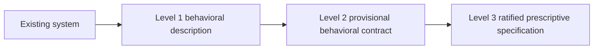
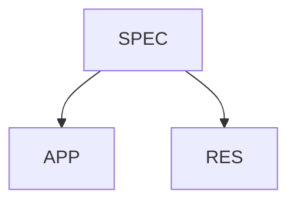
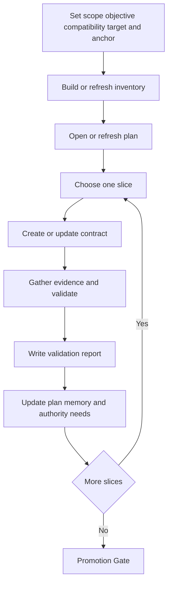

# NLSpec Reverse-Recovery Specification Corpus

A specification corpus for **reverse recovery**: the disciplined reverse-engineering path from an existing system back to a reviewable, ratifiable natural language specification.

This repository is for readers who need to understand:

- what the specification set is
- how authority is divided across the documents
- how to start using the corpus in a real repository or adjacent workspace
- which documents to read first for a given task

The corpus is written entirely in natural language for both human and AI readers. It has no code dependencies, no required runtime, and no mandatory toolchain. The defaults are software-repository-shaped, but the workflow can be applied to other recoverable systems when stable boundary artifacts, reviewable witnesses, and an explicit compatibility target exist.

## What this corpus is for

Reverse recovery exists for cases where the forward path:

`Intent -> specification -> implementation`

was skipped, only partly followed, or can no longer be reconstructed reliably.

In those cases, this corpus governs the reverse path:



At a high level:

- **Level 1** records what the system observably does.
- **Level 2** records a provisional contract, with support and uncertainty made explicit.
- **Level 3** is the ratified, prescriptive output that can become a real NLSpec under local governance rules.

The canonical term in this corpus is **reverse recovery**. In ordinary engineering language, you can think of it as a disciplined reverse-engineering workflow for specification recovery.

## How the corpus is organized

This repository currently contains three shared document classes.



| Class | Purpose | Authority |
|---|---|---|
| `SPEC` | Normative shared specifications | Conformance-bearing when adopted locally |
| `APP` | Application guidance and operating practice | Informative, practical, non-normative |
| `RES` | Compact reference aids | Informative, auxiliary |

A broader NLSpec-governed repository may also define local or shared `ADR` and `RFC` documents, but this shared corpus is centered on `SPEC`, `APP`, and `RES` documents.

Every governed document carries YAML front matter with at least a `doc_id`, `title`, and `status`. Shared files follow the pattern:

```text
<CLASS>-SHR-<NNN>-<slug>.md
```

The `SHR` segment indicates that these are **shared** cross-repository documents rather than local repository-specific governed documents.

## What each core specification owns

The corpus follows a strict **define-once** model. Each major concept has one authoritative home.

| Document | Owns |
|---|---|
| [`SPEC-SHR-000`](SPEC-SHR-000-local-repository-bootstrap.md) | Local bootstrap, document classes, front matter, lifecycle, scan rules, and local adoption semantics for shared specifications |
| [`SPEC-SHR-001`](SPEC-SHR-001-nlspec-spec.md) | The NLSpec quality target: completeness, recreatability, conceptual fidelity, spec economy, and ambiguity discipline |
| [`SPEC-SHR-002`](SPEC-SHR-002-reverse-engineering-specs.md) | The reverse-recovery workflow: slice states, evidence discipline, validation, authority review, Recovery Snapshots, and Promotion Gate behavior |
| [`SPEC-SHR-003`](SPEC-SHR-003-reverse-recovery-workspace-topology-and-discovery.md) | Reverse-recovery adoption, discovery, topology, structural posture, schema-companion resolution, and local override discovery |
| [`SPEC-SHR-004`](SPEC-SHR-004-reverse-recovery-governed-artifact-schemas.md) | Canonical governed-artifact schemas, omission semantics, continuity keys, and overlay field minima |
| [`SPEC-SHR-005`](SPEC-SHR-005-minimum-in-repository-cold-start-profile.md) | Minimum in-repository cold-start profile |
| [`SPEC-SHR-006`](SPEC-SHR-006-minimum-adjacent-workspace-cold-start-profile.md) | Minimum adjacent-workspace cold-start profile |

A useful rule of thumb is:

- **`SPEC-SHR-002` owns why and when**
- **`SPEC-SHR-004` owns what shape**
- **`SPEC-SHR-003` owns where it lives and how it is discovered**
- **`SPEC-SHR-000` owns how it becomes locally governed**
- **`SPEC-SHR-001` owns what “good enough to be an NLSpec” means**

## The reverse-recovery loop at a glance

Reverse recovery is intentionally iterative. It does not proceed as one large summarization pass.



A **slice** is the smallest bounded recovery unit that can be contracted, evidenced, validated, and either closed or explicitly bounded.

## How repositories use this corpus

A repository or governed workspace typically uses the corpus in this order:

1. Adopt local bootstrap rules through [`SPEC-SHR-000`](SPEC-SHR-000-local-repository-bootstrap.md).
2. Choose a cold-start mode:
   - [`SPEC-SHR-005`](SPEC-SHR-005-minimum-in-repository-cold-start-profile.md) for work **inside** the target repository
   - [`SPEC-SHR-006`](SPEC-SHR-006-minimum-adjacent-workspace-cold-start-profile.md) for work in an **adjacent governed workspace**
3. Adopt reverse recovery through the discovery file defined by [`SPEC-SHR-003`](SPEC-SHR-003-reverse-recovery-workspace-topology-and-discovery.md):

   ```text
   /.nlspec/reverse-recovery.yaml
   ```

4. Materialize the recovery working tree outside the local governed `document_roots`.
5. Run the slice-based workflow defined by [`SPEC-SHR-002`](SPEC-SHR-002-reverse-engineering-specs.md), using the governed-artifact shapes defined by [`SPEC-SHR-004`](SPEC-SHR-004-reverse-recovery-governed-artifact-schemas.md).
6. When promotion succeeds, emit local governed outputs under the repository’s local governed-document roots, following the lifecycle and adoption rules from [`SPEC-SHR-000`](SPEC-SHR-000-local-repository-bootstrap.md).

Two practical points matter here:

- Shared documents are **read by explicit reference**. Their mere presence in a filesystem does not make them locally authoritative.
- A shared `SPEC` becomes locally binding only when the local repository or governed workspace **adopts** it through the mechanisms that the governing specifications define.

## Recommended reading paths

### First-time reader

If you are new to the corpus, this is the shortest reliable path:

1. [`SPEC-SHR-000`](SPEC-SHR-000-local-repository-bootstrap.md)
2. Exactly one cold-start profile:
   - [`SPEC-SHR-005`](SPEC-SHR-005-minimum-in-repository-cold-start-profile.md), or
   - [`SPEC-SHR-006`](SPEC-SHR-006-minimum-adjacent-workspace-cold-start-profile.md)
3. [`SPEC-SHR-003`](SPEC-SHR-003-reverse-recovery-workspace-topology-and-discovery.md)
4. [`SPEC-SHR-001`](SPEC-SHR-001-nlspec-spec.md)
5. [`SPEC-SHR-002`](SPEC-SHR-002-reverse-engineering-specs.md)
6. [`SPEC-SHR-004`](SPEC-SHR-004-reverse-recovery-governed-artifact-schemas.md)
7. [`APP-SHR-002`](APP-SHR-002-cold-start-quickstart-and-first-slice-template.md)
8. [`APP-SHR-003`](APP-SHR-003-corpus-entry-and-reading-guide.md)

### Start a new recovery from scratch

| Need | Read first |
|---|---|
| In-repository cold start | [`SPEC-SHR-005`](SPEC-SHR-005-minimum-in-repository-cold-start-profile.md), then [`APP-SHR-002`](APP-SHR-002-cold-start-quickstart-and-first-slice-template.md) |
| Adjacent-workspace cold start | [`SPEC-SHR-006`](SPEC-SHR-006-minimum-adjacent-workspace-cold-start-profile.md), then [`APP-SHR-002`](APP-SHR-002-cold-start-quickstart-and-first-slice-template.md) |
| Full routing help | [`APP-SHR-003`](APP-SHR-003-corpus-entry-and-reading-guide.md) |

### Move beyond the first loop

After the first slice closes, the stabilized operational baselines are:

- [`APP-SHR-004`](APP-SHR-004-repository-shaped-reverse-recovery-operating-baseline.md) for repository-shaped reconnaissance, executable-feasibility judgment, target-anchor axis selection, and structure-recovery operating patterns
- [`APP-SHR-005`](APP-SHR-005-authority-closure-and-promotion-handoff-baseline.md) for packet-first authority intake, same-operator disclosure, minimum viable Authority Disposition practice, and promotion handoff

### Resume paused work

Read these together:

- [`SPEC-SHR-002`](SPEC-SHR-002-reverse-engineering-specs.md) for Recovery Snapshots, recovery memory, and revalidation rules
- [`SPEC-SHR-004`](SPEC-SHR-004-reverse-recovery-governed-artifact-schemas.md) for Recovery Snapshot field minima
- [`SPEC-SHR-003`](SPEC-SHR-003-reverse-recovery-workspace-topology-and-discovery.md) for workspace posture and discovery
- [`APP-SHR-001`](APP-SHR-001-applying-reverse-recovery.md) when you need the broader draft guidance for recovery memory and partial handoff

### Review an authority packet or promotion handoff

Read these together:

- [`SPEC-SHR-002`](SPEC-SHR-002-reverse-engineering-specs.md) for authority-review workflow meaning and Promotion Gate behavior
- [`SPEC-SHR-004`](SPEC-SHR-004-reverse-recovery-governed-artifact-schemas.md) for Authority Review Packet and Authority Disposition field minima
- [`APP-SHR-005`](APP-SHR-005-authority-closure-and-promotion-handoff-baseline.md) for the stabilized operational packet and promotion-handoff baseline

## Document map

### Normative shared specifications

| Document | Status | What it covers |
|---|---|---|
| [`SPEC-SHR-000`](SPEC-SHR-000-local-repository-bootstrap.md) | `active` | Local repository bootstrap, shared-document adoption, naming, front matter, lifecycle, and scan rules |
| [`SPEC-SHR-001`](SPEC-SHR-001-nlspec-spec.md) | `active` | What an NLSpec is and how to judge completeness and quality |
| [`SPEC-SHR-002`](SPEC-SHR-002-reverse-engineering-specs.md) | `active` | Reverse-recovery workflow, evidence discipline, validation, authority review, Recovery Snapshots, and Promotion Gate |
| [`SPEC-SHR-003`](SPEC-SHR-003-reverse-recovery-workspace-topology-and-discovery.md) | `active` | Reverse-recovery adoption, discovery, topology, structural posture, and local override discovery |
| [`SPEC-SHR-004`](SPEC-SHR-004-reverse-recovery-governed-artifact-schemas.md) | `active` | Governed-artifact schemas, omission semantics, continuity rules, and overlay field minima |
| [`SPEC-SHR-005`](SPEC-SHR-005-minimum-in-repository-cold-start-profile.md) | `active` | Minimum in-repository cold-start stack |
| [`SPEC-SHR-006`](SPEC-SHR-006-minimum-adjacent-workspace-cold-start-profile.md) | `active` | Minimum adjacent-workspace cold-start stack |

### Application guides

| Document | Status | What it covers |
|---|---|---|
| [`APP-SHR-001`](APP-SHR-001-applying-reverse-recovery.md) | `draft` | Broader draft operating guidance: recovery memory, partial recovery, composition examples, and later-stage correction patterns |
| [`APP-SHR-002`](APP-SHR-002-cold-start-quickstart-and-first-slice-template.md) | `active` | Quickstart, placement chooser, smallest viable workspace, and first-loop templates |
| [`APP-SHR-003`](APP-SHR-003-corpus-entry-and-reading-guide.md) | `active` | Role-based routing and minimum reading paths through the corpus |
| [`APP-SHR-004`](APP-SHR-004-repository-shaped-reverse-recovery-operating-baseline.md) | `active` | Stable repository-shaped operating baseline after the first loop |
| [`APP-SHR-005`](APP-SHR-005-authority-closure-and-promotion-handoff-baseline.md) | `active` | Stable authority-review and promotion-handoff baseline |

### Reference aid

| Document | Status | What it covers |
|---|---|---|
| [`RES-SHR-001`](RES-SHR-001-reverse-recovery-workflow-state-transition-reference.md) | `draft` | Compact workflow-state transition and revalidation reading aid |

## Key concepts

| Term | Meaning |
|---|---|
| **NLSpec** | A natural language specification precise enough to guide faithful implementation for the declared scope |
| **Reverse recovery** | The disciplined process of recovering a specification from an already-existing system |
| **Slice** | A bounded recovery unit with a contract, evidence, validation result, and resolution path |
| **Target anchor** | The normalized revision, deployment, consumer, environment, or data anchor that fixes what state the evidence applies to |
| **Recovery Snapshot** | A resumable handoff surface for paused or transferred work |
| **Promotion Gate** | The formal checkpoint that determines whether recovered material is ready for ratification into a prescriptive specification |

## File conventions and versioning

All specifications use semantic versioning in `MAJOR.MINOR.PATCH` form.

In practice:

- a workspace conforms to the version line it explicitly adopts
- changing the adopted version is not historical commentary
- version changes may require artifact migration or an explicit compatibility note
- [`SPEC-SHR-002`](SPEC-SHR-002-reverse-engineering-specs.md) and [`SPEC-SHR-004`](SPEC-SHR-004-reverse-recovery-governed-artifact-schemas.md) are intended to be adopted together even though they are versioned independently

## Repository layout

```text
.
├── SPEC-SHR-000-local-repository-bootstrap.md
├── SPEC-SHR-001-nlspec-spec.md
├── SPEC-SHR-002-reverse-engineering-specs.md
├── SPEC-SHR-003-reverse-recovery-workspace-topology-and-discovery.md
├── SPEC-SHR-004-reverse-recovery-governed-artifact-schemas.md
├── SPEC-SHR-005-minimum-in-repository-cold-start-profile.md
├── SPEC-SHR-006-minimum-adjacent-workspace-cold-start-profile.md
├── APP-SHR-001-applying-reverse-recovery.md
├── APP-SHR-002-cold-start-quickstart-and-first-slice-template.md
├── APP-SHR-003-corpus-entry-and-reading-guide.md
├── APP-SHR-004-repository-shaped-reverse-recovery-operating-baseline.md
├── APP-SHR-005-authority-closure-and-promotion-handoff-baseline.md
└── RES-SHR-001-reverse-recovery-workflow-state-transition-reference.md
```

## Status

This corpus is under active development.

- Documents marked `active` are stable for their declared scope.
- Documents marked `draft` are usable, but are expected to evolve.
- Shared application and reference documents support the normative stack, but do not replace it.

If you are entering the corpus for the first time, start with [`APP-SHR-003`](APP-SHR-003-corpus-entry-and-reading-guide.md), then choose exactly one cold-start profile and work forward from there.
